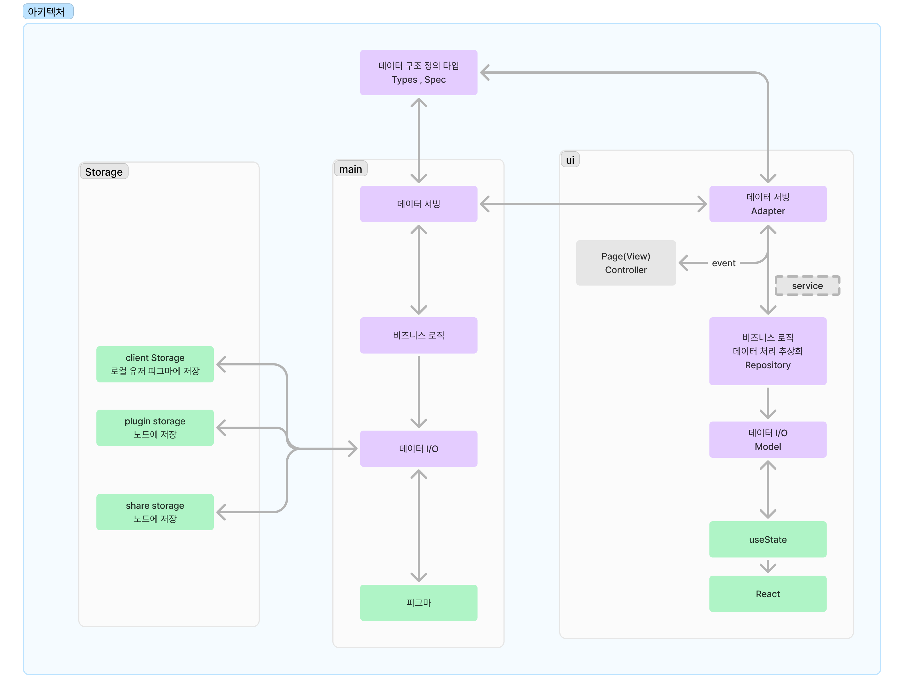

# 사용 예시

[Types/Spec](#Types/Spec) 에서  
개발하고자하는 서비스에서 도메인을 위해 정의되는 데이터에 대한 타입 정의를 한다

지금 프로젝트의 경우  
main 또는 ui 를 위한 인터페이스를 만들고

메세지 프로토콜을 위한 이벤트 리스너를 생성한다  
이벤트 리스너 자체가 어떤 행동이 발생하기 위한 조건을 담고 있는 경우가 많다  
그렇기에 추상화된 행동을 정의하며 [Adapter](#Adapter) 에 작서할 수 있다

- 리스너 또는 이미터 선언 로직을 담으면 된다
- 프로토콜 관련된 타입도 이곳에

[Adapter](#Adapter) 를 트리거로 하거나 [Adapter](#Adapter) 로 인한 데이터 변경을 트리거로 [Service](#Service) 를 실행 시킬 수 있다  
[Service](#Service) 는 [Repository](#Repository) 를 통해 [Model](#Model) 에서 데이터를 받거나  
[Adapter](#Adapter) 가 받아온 데이터를 기반으로 수행하고자하는 로직을 처리한 후

다음 동작으로 연결 시킨다 [View](#View) 나 [Repository](#Repository) 로 연결하거나 다른 [Service](#Service) 도 가능

# Logic

## Types/Spec

- 모든 레이어가 공유하는 인터페이스와 타입 정의

## Adapter

- 외부 시스템과의 통합 구현
- 주로 post 메세지 처리 할 것임
- 특정 [Service](#Service) 를 실행시키기 위한 트리거로도 동작

## Service

- 핵심 비즈니스 로직 구현
- 트랜잭션 처리
- [Repository](#Repository) 와 [Adapter](#Adapter) 조합

## Repository

- 데이터 접근 추상화
- [Model](#Model) 을 사용해서 데이터에 접근하는 것
- 입/출력 처리

## Model

- 도메인 엔티티와 값 객체
- 비즈니스 규칙과 제약조건들
- 직접적인 데이터 처리 로직
- 스토어가 하나인 상황에서 제약조건으로 락킹 분리하는 목적으로 쓰는게 목적

# View

## apps

- 배포 폴더로 사용
- ui.tsx 랑 main.tsx

## pages

- 페이지 컴포넌트 분리용

## components

- 리엑트 컴포넌트들

## controller

- 주로 데이터 핸들링하는 로직들
