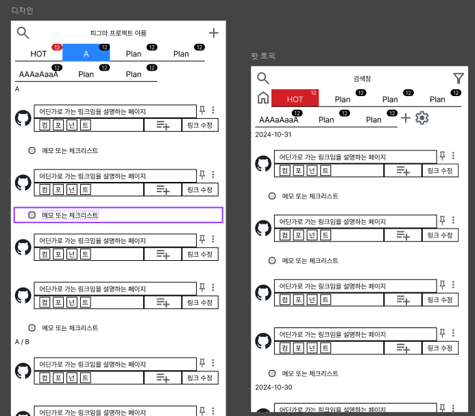

# TODO

- [ ] 커스터 모달 preact 버전 구현
- [ ] 메모 추가 기능 UI

- [ ] 핫토픽 탭
- [ ] 데이터 부분 업데이트를 위한 설계가 잘 적용됬는지 검증

# 2024-11-06

- [ ] 메모 카테고리 기반 카테고리 탭 생성

# 2024-11-04

- [x] 피그마 인터렉션 기능
- [x] 섹션 키 생성
  - 최소를 페이지 단위로 조회 대상을 정해서 호출하는 게 기획
  - 섹션이 있으면 섹션으로 호출 대상을 한정함
  - 키 조회는 섹션 이름 기준 startWith 로 하위 대상을 섹션 리스트에서 선택해서 조회함
  - 페이지 이름도 여러 개 부여할 수 있게 하면 시스템 꼬임 > 섹션 처리에서 문제

# 2024-11-03

- [x] 타입들을 정의
- [x] 타입 수정 인터페이스들 정의
- 섹션 목록 저장 기능
- 객체형 데이터의 추가 제거 컨벤션
- 테스트용 인터페이스 추가

# 2024-11-01

- preact signal 타입이 자동으로 매핑되도록 타입 정의

# 2024-10-31

- sass 추가 시도 실패
  - 토큰 선언 대안 필요함
- preact signal 테스트
  - 전파 테스트 결과 값은 변경되고 유지되나 그 이벤트가 ui 에 전파되지 않음
  - ref와 비슷하게 동작하는 것 같음
  - effect를 써서 감시하게 할 수 있었음
    - Provider 를 만드는 디펜던시냐 effect로 이벤트를 생성시키는 디펜던시냐의 차이로 고민함
    - effect 를 써서 감시하는 구조로 결정함
- ui 와이어 프레임 1차 완료
  

# 2024-10-30

- 아키텍처 테스트 겸 타입 정의
- 프로젝트 초기 세팅

# ~2024-10-29

- 기획안 최종 [정리 링크](https://publish.obsidian.md/bangjunwoo/%EA%B7%B8%EB%A1%9C%EC%8A%A4+%EB%94%94%EC%9E%90%EC%9D%B8/%EA%B3%BC%EC%A0%9C/202410291455)

# ~2024-10-25

- 구조 설계 [링크](https://www.figma.com/board/2ROOGC9UAKaxmeIQGpID9E/%EB%A7%81%ED%81%AC-%EB%A9%94%EB%AA%A8-%EB%8D%B0%EC%9D%B4%ED%84%B0-%EC%B2%98%EB%A6%AC-%EA%B5%AC%EC%A1%B0?node-id=0-1&t=sygj0HY0gwufjiIB-1)

# ~2024-10-21

- 초기 [그로스 디자인 프로젝트 기획](https://publish.obsidian.md/bangjunwoo/%EA%B7%B8%EB%A1%9C%EC%8A%A4+%EB%94%94%EC%9E%90%EC%9D%B8/%EA%B3%BC%EC%A0%9C/202410151332)
